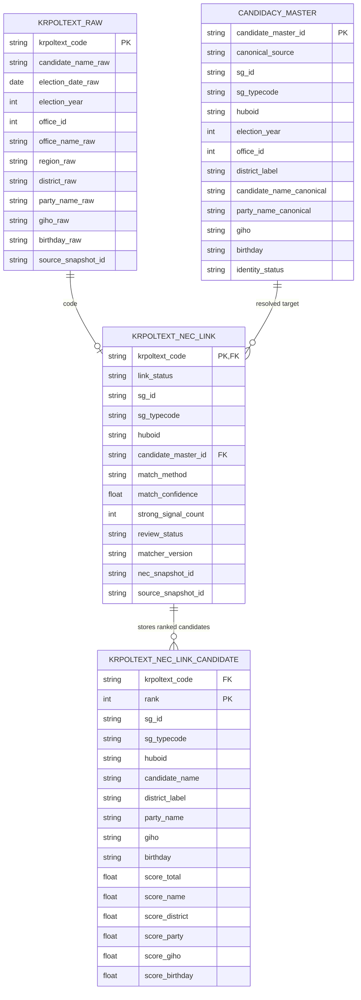

# krpoltext-NEC 후보자 링크 1페이지 ERD

## 목적

`krpoltext`의 `campaign_booklet` row를 NEC 후보자 `(sg_id, sg_typecode, huboid)`에 안전하게 연결하기 위한 최소 ERD다. 핵심은 내부적으로는 원본 보존과 링크 결과 분리를 유지하면서, 공개 배포는 enriched artifact 하나로 수렴하는 것이다.

## 관계 해설

- `KRPOLTEXT_RAW`는 원본 row를 보존한다.
- `KRPOLTEXT_NEC_LINK`는 각 `code`에 대한 최종 연결 결과를 1개만 가진다.
- `KRPOLTEXT_NEC_LINK_CANDIDATE`는 ambiguous하거나 review가 필요한 경우 후보군과 점수를 저장한다.
- `CANDIDACY_MASTER`는 여러 소스를 장기적으로 묶고 싶을 때 쓰는 선택적 통합 레이어다.

## 공개 배포 모델

- package와 API는 `KRPOLTEXT_RAW + KRPOLTEXT_NEC_LINK`를 합친 enriched 결과를 기본으로 제공한다.
- 공개 CSV와 공개 Parquet는 동일한 enriched 스키마를 가져야 한다.
- `KRPOLTEXT_RAW`, `KRPOLTEXT_NEC_LINK`, `KRPOLTEXT_NEC_LINK_CANDIDATE`는 내부 운영 또는 archive/provenance 레이어로 남길 수 있다.
- `huboid`는 native field가 아니라 `kr-elections-mcp` alignment를 위한 linked identifier로 문서화해야 한다.

## 핵심 규칙

1. `krpoltext_code`는 문서 row 식별자이고, 후보자 식별자가 아니다.
2. `huboid`는 native field가 아니라 audited linkage 결과다.
3. `resolved`가 아닌 row는 `huboid`를 비워 둔다.
4. 이름은 단독 키가 아니며, 최종 확정에는 `birthday` 또는 `giho` 같은 strong signal이 필요하다.
5. 배포용 분석 데이터는 `KRPOLTEXT_RAW`에 `KRPOLTEXT_NEC_LINK`를 붙인 enriched artifact 하나로 제공하는 것이 권장된다.

## 상태 정의

- `link_status`: `resolved`, `ambiguous`, `not_found`, `rejected`
- `review_status`: `auto_accepted`, `needs_review`, `human_accepted`, `human_rejected`

## 권장 사용 순서

1. `KRPOLTEXT_RAW` 적재
2. NEC snapshot 기준 후보군 생성
3. `KRPOLTEXT_NEC_LINK_CANDIDATE`에 ranked candidates 저장
4. 자동 확정 가능한 건 `KRPOLTEXT_NEC_LINK`에 `resolved`로 저장
5. ambiguous한 건 사람 검토 후 상태 갱신
6. 최종적으로 package/API와 공개 배포는 `krpoltext_enriched` 뷰/테이블을 기준으로 제공
